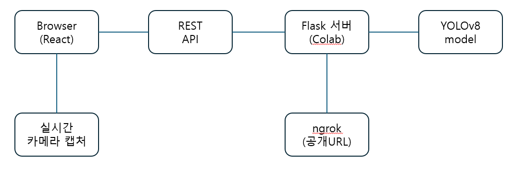

# 포트폴리오

# YOLOv8 기반 실시간 객체 인식 웹 서비스

## 프로젝트 개요
Google Colab과 Flask, React, YOLOv8을 이용하여 **브라우저에서 실시간으로 객체를 인식하는 웹 서비스**를 구현한 프로젝트입니다.  
추론은 YOLOv8 모델을 활용하고, pyngrok을 통해 외부에서도 접속 가능한 실시간 API를 제공하며, 프론트엔드에서는 카메라 영상에 대해 실시간으로 바운딩 박스를 시각화합니다.

- **프로젝트명:** YOLOv8 실시간 객체 인식 웹앱
- **주요 목표:** 브라우저에서 실시간 영상 기반 객체 인식이 가능한 경량 AI 웹 애플리케이션 구현
- **사용 환경:** Google Colab (Python 기반), 모바일 웹 접속 가능

---

## 주요 기능

- 실시간 객체 인식 기능
- 웹 기반 인터페이스 제공
- REST API를 통한 이미지 전송 및 결과 수신
- 주기적인 이미지 캡처 및 자동 처리 기능
- 객체 감지 결과 시각화 기능
- 카메라 전환 기능 제공

---

## 기술 스택

| 영역        | 기술                                   |
|-------------|----------------------------------------|
| Frontend    | HTML, React.js, Bootstrap, Canvas API  |
| Backend     | Flask, Flask-CORS, pyngrok, OpenCV     |
| 모델        | YOLOv8 (ultralytics 라이브러리)        |
| 개발 환경   | Google Colab (Jupyter Notebook 기반)   |
| 배포 접근   | ngrok (https 기반 터널링)              |

---

## 시스템 아키텍처

---

## 해결한 주요 이슈

| 문제 | 해결 방법 |
|------|------------|
| Colab은 외부 접속 불가 | pyngrok으로 외부 HTTPS 터널 생성 |
| YOLOv8 추론 지연 | YOLOv8n 경량 모델 사용 및 주기 제어 |

---

## 학습한 기술 및 인사이트

- YOLOv8 모델의 구조와 출력 처리 방식
- React 상태 관리 및 Canvas API 활용
- Colab 기반 AI 서비스 배포 환경 구성 방법
- 클라이언트-서버 간 데이터 흐름 이해
- 산업 결함 검출 할 때 사용시 비용 절감

---

## 향후 개선 방향

- 모델 업그레이드 및 정확도 향상
- 지속 가능한 서버 환경으로 이전
- 사용자 인터페이스 개선
- 보안 및 인증 강화

---

## 포트폴리오 링크

(https://github.com/your-username/yolov8-object-detection-webapp)

---
